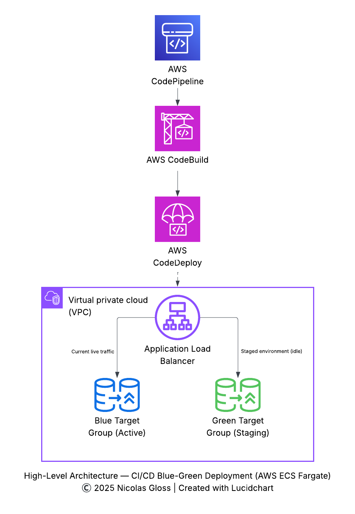
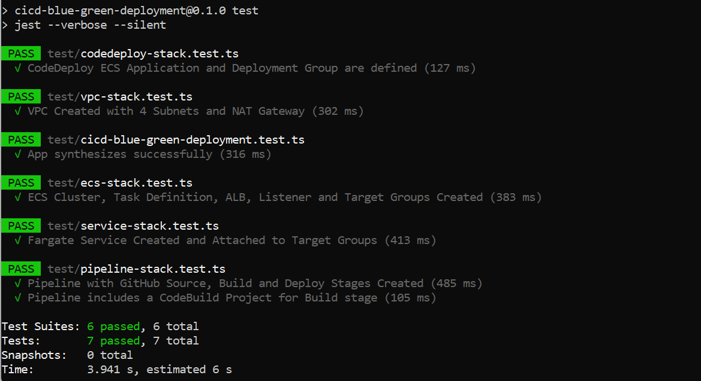
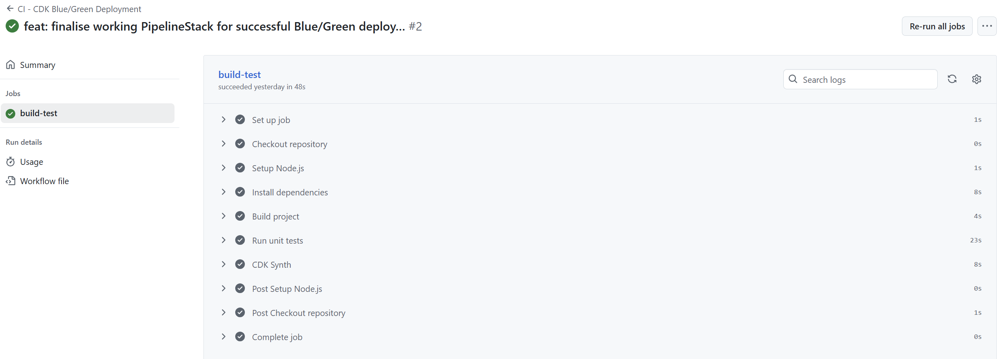
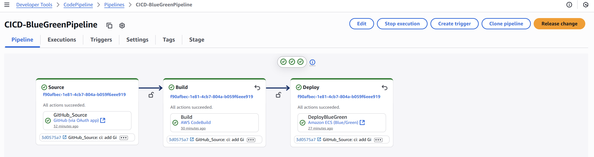
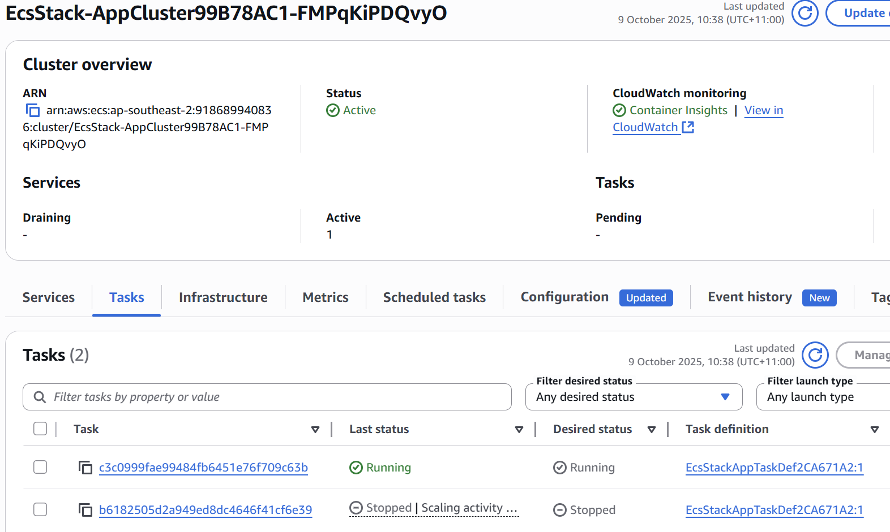

# 🚀 CI/CD Blue-Green Deployment on AWS ECS

[](https://github.com/nicolasgloss-dev/cicd-blue-green-deployment/actions/workflows/ci.yml)

---

## 📖 Overview
This project showcases a **fully automated CI/CD pipeline** for an Amazon ECS Fargate application using **Blue/Green deployments** on AWS.

The workflow:
- **GitHub Actions (CI)** → Runs Jest unit tests and CDK build on every push.  
- **AWS CodePipeline (CD)** → Deploys automatically from GitHub to ECS Fargate with Blue/Green rollout and automatic rollback.

Infrastructure is defined in **AWS CDK (TypeScript)**, providing reproducible deployments aligned with AWS best practices.

---

## 🎯 Business Need
Modern applications require:
- Fast feedback and test automation before deployment.  
- Safe, automated rollouts with near-zero downtime.  
- Rapid rollback if new versions fail.

This solution meets those goals through **GitHub-driven CI** and **AWS-native Blue/Green CD**.

---

## 🏗️ Architecture

### 🖼️ Architecture Diagram


*High-level architecture of the CI/CD Blue-Green deployment (exported from Lucidchart).*

**Key Components**
- **GitHub Repository** – Source code + CI workflow (`ci.yml`).  
- **GitHub Actions** – Runs Jest tests and CDK build.  
- **AWS CodePipeline** – Orchestrates build → deploy stages.  
- **AWS CodeBuild** – Synthesises CDK and builds artefacts.  
- **AWS CodeDeploy** – Controls Blue/Green rollout & rollback.  
- **ECS Fargate Cluster** – Serverless container runtime.  
- **Application Load Balancer** – Routes traffic between Blue/Green target groups.  
- **VPC** – Two-AZ design with public + private subnets and NAT Gateway.

---

## 🛠️ AWS Services Used
- **Amazon VPC** → Two AZs, public/private subnets, single NAT Gateway.  
- **Amazon ECS Fargate** → Serverless container hosting.  
- **Application Load Balancer** → Routes traffic between Blue/Green target groups.  
- **AWS CodePipeline** → CI/CD orchestration.  
- **AWS CodeBuild** → CDK synthesis and build stage.  
- **AWS CodeDeploy** → Blue/Green deployment control & rollback.  
- **AWS Secrets Manager** → Secure GitHub token storage.  
- **AWS IAM** → Scoped least-privilege roles.  
- **Amazon CloudWatch** → Logs and ECS task metrics.

---

## ⚙️ Step-by-Step Implementation
1. **VpcStack** → Networking: VPC, subnets, NAT.  
2. **EcsStack** → ECS cluster, NGINX task definition, ALB + target groups.  
3. **ServiceStack** → ECS Fargate service registered with target groups.  
4. **CodeDeployStack** → ECS Application + Deployment Group.  
5. **PipelineStack** → GitHub Source → CodeBuild → CodeDeploy.  
6. **GitHub Actions (CI)** → `.github/workflows/ci.yml` runs build + tests before deployment.

---

## 🧪 Testing Strategy
Stack-level **Jest unit tests** verify key resources:

| Stack | Validated Components |
|-------|----------------------|
| **VpcStack** | VPC, subnets, NAT Gateway |
| **EcsStack** | ECS cluster, task definition, ALB, target groups |
| **ServiceStack** | ECS service, target group registration |
| **CodeDeployStack** | ECS Application + Deployment Group |
| **PipelineStack** | Source, Build, Deploy stages |

These tests ensure infrastructure correctness before deployment.

---

## 📷 Screenshots

Key visuals from this project demonstrate automated CI/CD verification and deployment flow:

---

### ✅ Unit Tests Passing
  
*All Jest unit tests successfully passed (7/7), validating the CDK infrastructure stacks.*

---

### 🔄 GitHub Actions CI
  
*CI pipeline automatically runs Jest tests and CDK build on each push to main.*

---

### 🧾 Build Artifact Logs
  
*CI/CD build logs displaying the generated deployment files — `taskdef.json`, `appspec.yaml`, and `imagedefinitions.json` — followed by verification of `appspec.yaml` contents containing the valid **Task Definition ARN**.  
This confirms that CodeBuild successfully packaged and validated ECS deployment artifacts prior to the Blue/Green rollout.*

---

### 🚀 AWS CodePipeline Stages
  
*Automated CodePipeline stages performing Source → Build → Deploy Blue/Green rollout.*

---

### 🟢 ECS Service Blue/Green
  
*ECS Fargate service showing Blue/Green task sets managed by CodeDeploy behind the ALB.*

---

## ✅ Expected Outcomes
- Push to GitHub triggers:
  1. **CI (GitHub Actions):** Run tests + build.  
  2. **CD (CodePipeline):** Build → Deploy to ECS.  
- ECS Blue/Green deployment with automatic rollback on failure.  
- Demonstrates **hybrid CI/CD** (GitHub + AWS native).  
- Portfolio-ready project showcasing IaC, testing, cost awareness and security-first design.

---

## ⚠️ Failure Scenarios & Mitigations
- **Unit test failure:** GitHub Actions blocks deployment.  
- **CDK deployment error:** CI step fails before pipeline deploys; issue identified via `cdk synth` and Jest tests.  
- **Pipeline build failure:** CodePipeline halts before deployment.  
- **Container fails health check:** CodeDeploy automatically rolls back to last healthy task set.  
- **Unhealthy ECS tasks:** Rollback initiated by CodeDeploy monitoring.  
- **Invalid IAM or ECS configuration:** Caught by CDK validation and unit tests before deployment.

---

## 💸 Cost Optimisation
- Two AZ VPC with one NAT Gateway to reduce network costs.  
- **Fargate** → Pay-per-running-task (avoids idle EC2 costs).  
- **Application Load Balancer** → Regional scope in public subnets.  
- **CodePipeline** → 1 active pipeline/month included in AWS Free Tier — ideal for demo workloads.  
- **GitHub Actions** → CI runs within free tier for personal projects (no ongoing cost).  
- Lightweight setup keeps expenses portfolio-friendly.

---

## 🔐 Security Considerations
- **Secrets Manager** → Stores GitHub token securely.  
- **IAM** → Scoped least-privilege roles per service.  
- **Private Subnets** → ECS tasks isolated behind NAT.  
- **Security Groups** → Restrict traffic to required ports (e.g. ALB → ECS tasks).

---

## 🌱 Possible Enhancements
- Upgrade ECS monitoring to `containerInsightsV2` when CDK supports it.  
- Add manual approval stage to CodePipeline.  
- Extend CI with linting + security scans.  
- Add Lambda hooks for pre/post-traffic health checks.  
- Create CloudWatch dashboards for deeper visibility.  
- Replace NGINX demo with real microservice sample.

---

## ⚡ Challenges & Solutions
- **Cross-stack dependencies** → Solved with CDK props (VPC, TGs, listener).  
- **Blue/Green complexity** → Simplified via modular stacks + CodeDeploy config.  
- **Hybrid CI/CD** → Combined GitHub CI with AWS-native CD pipeline.  
- **ECS DeploymentController** → Learned that Blue/Green via CodeDeploy requires `deploymentController: CODE_DEPLOY`.  
- **Deprecation (Cluster Monitoring)** → Attempted `containerInsightsV2`, reverted to `containerInsights: true` pending CDK support.

---

## 🧹 Clean-up Steps
To avoid charges after testing:
```bash
cdk destroy --all
```
Then manually remove:
- Secrets Manager GitHub token.  
- ALB and NAT Gateway (if not auto-deleted).

---

## 💡 Reflection / Lessons Learned
- Integrated GitHub Actions with AWS CodePipeline.  
- Gained hands-on experience with ECS Blue/Green deployments.  
- Practised IaC testing using Jest with CDK.  
- Handled CDK deprecations and documented trade-offs.  
- Improved understanding of deployment controllers and rollback mechanisms.  
- Strengthened documentation and design clarity through structured ADRs.


**Additional Reflection:**  
Through this project, I reinforced how Infrastructure as Code, CI/CD, and testing intersect in modern cloud engineering. I learned to think about deployment safety and rollback paths as part of design — not as afterthoughts — and to document trade-offs like CDK deprecations clearly. This hands-on experience strengthened my ability to design, test, and explain reliable AWS delivery pipelines in real-world contexts.

---
## 🔗 Project Links

- **Project Page:** https://nicolasgloss.com/projects/cicd-blue-green-deployment  
- **GitHub Repo:** https://github.com/nicolasgloss-dev/cicd-blue-green-deployment  
- **Architecture Decision Record (ADR):** [docs/adr.md](docs/adr.md)

📘 **Full Engineering Write-up:** [docs/README-detailed.md](docs/README-detailed.md)

---
